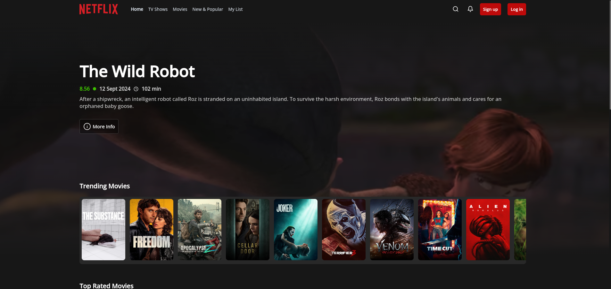

# [Netflix Redesigned](https://netflix-redesigned.vercel.app/)

Redesigned version of Netflix made with [Next.js](https://nextjs.org/) and [Supabase](https://supabase.com/).

## Features

- Fullstack app made with Next.js 15 App Router (React Server Components, Server Actions) & Supabase (PostgreSQL)
- Users can add & remove their favorite media
- Implemented basic JWT auth from scratch
- Search functionality
- Responsive design
- CI/CD with [Github Actions](https://github.com/kpeta/netflix-v2/tree/master/.github/workflows), deployed with [Vercel](https://vercel.com/)

---

## Known issues with App Router

As the App Router introduced new features and breaking changes (such as React Server Components), some compatibility issues arised with certain third-party libraries during development at the time (May 2024):

- [`styled-components`](https://styled-components.com/) didn't support React Server Components, so I've used React Inline Styles instead (for CSS-in-JS) and CSS modules for media queries, pseudo-classes and keyframes
- [`Jest`](https://jestjs.io/) didn't support React Server Components
